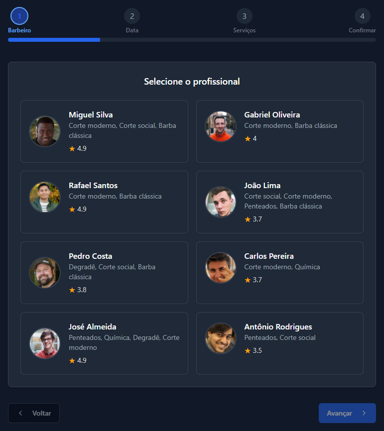

# ✂️ BarberTime 💇‍♂️

## 📱 Sobre o Projeto

BarberTime é uma plataforma inovadora para agendamento de serviços de barbearia. O sistema permite que clientes encontrem, avaliem e agendem serviços com barbeiros de sua preferência de maneira rápida e eficiente.

## ✨ Funcionalidades Principais

- 📅 **Agendamento online**: Marque horários com seu barbeiro favorito em poucos cliques
- 👨‍💼 **Perfis de profissionais**: Visualize trabalhos, avaliações e especialidades
- ⭐ **Sistema de avaliação**: Compartilhe sua experiência e veja opiniões de outros clientes
- 📊 **Painel do barbeiro**: Gerenciamento completo de agenda e clientes
- 🔔 **Notificações**: Lembretes automáticos de compromissos

## 📱 Fluxo de Agendamento

Abaixo está o fluxo completo de agendamento na plataforma BarberTime para clientes:

    

        
        
<strong>1. Login do Cliente</strong> - Autenticação segura para acessar a plataforma.

    

    

        
        
<strong>2. Escolha do Barbeiro</strong> - Seleção de profissionais disponíveis.

    

    

        
        
<strong>3. Seleção de Data</strong> - Escolha da data e horário para o atendimento.

    

    

        
        
<strong>4. Escolha do Serviço</strong> - Seleção do tipo de corte desejado.

    

    

        
        
<strong>5. Confirmação</strong> - Revisão dos detalhes do agendamento.

    

    

        
        
<strong>6. Sucesso</strong> - Confirmação do agendamento realizado.

    

## 🛠️ Tecnologias Utilizadas

- 📱 **Frontend**: React Native
- 🖥️ **Backend**: Node.js, Fastify
- 🗄️ **Banco de Dados**: MongoDB
- 🔐 **Autenticação**: JWT, OAuth
- 🐳 **Containerização**: Docker
- 🚀 **Deploy**: SSH para implantação em servidor remoto

## 📞 Interesse no Projeto?

Você tem interesse em conhecer mais sobre o BarberTime ou implementá-lo em seu negócio? Entre em contato:

- 📧 **Email**: leonardooliveiradias1@gmail.com

Estou aberto a parcerias, sugestões e oportunidades de negócio relacionadas ao BarberTime. Ficarei feliz em responder a todas as suas dúvidas! 